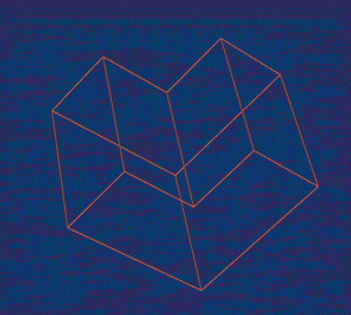
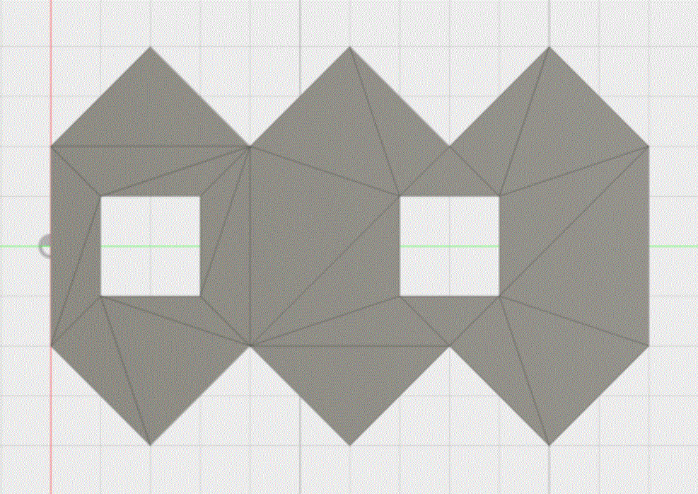
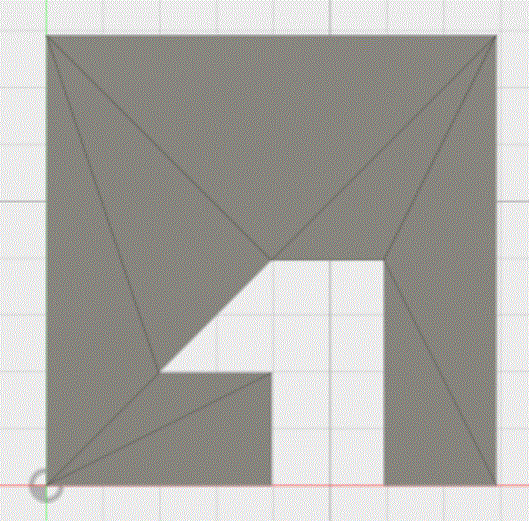

# Mesh/brep representation

This is a library that allows to represent brep. There is a library to create Body, Face, Edge, ...

At the moment it is able to describe only geoemtric points (mesh).

# Mesh boolean

It is possible to use the class BooleanLLIsolver to make boolean operation between bodies.
The above picture is the difference of two bodies.

Some video explains the power of this tool:
[Bool Video 1](doc/Bunnies_boolean.gif)
[Bool Video 2](doc/Tower1.mp4)
[Bool Video 3](doc/Tower2.gif)
[Bool Video 4](doc/Mesh_boolean.gif)
[Bool Video 5](doc/Mesh_boolean_2.gif)

# Find a triangulation for a 3d polygon

Iterate over all vertices and creates a triangle for the polygon with smaller angle.

The polygon is supposed to be approximately planar, it can have concave vertices and holes.

Examples:

# Toolkit

The project vtk_cad it a toolkit to visualize bodies based on vtk.

# Dependencies:

- cmake
- eigen
- vtk
