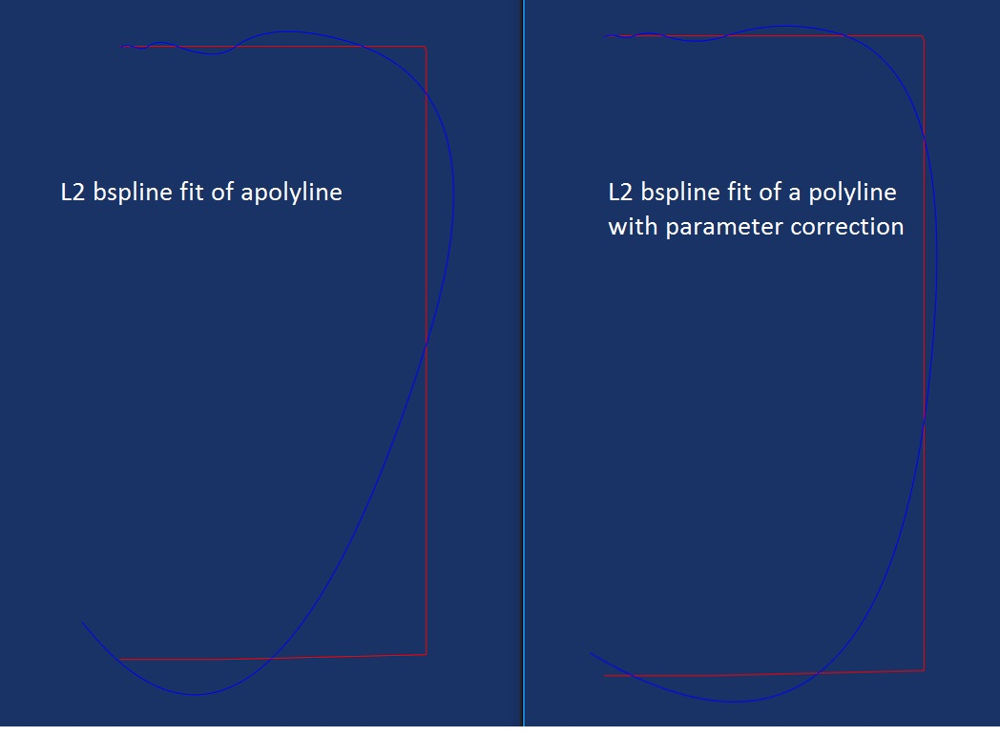

# Curve fit with bspline.

Fit a 2d curve with a B-Spline.
The B-Spline has a predeined set of knots and the problem is to 
find the set of control points that minimize the distance with the 
given curve.

Input: knot sequence and a function. The function must define two functions:
- evaluation at a parameter
- closest point from a point (a guess parameter must be provided)

The class provide several options that can be used to set-up the L2 problems:
- number of samples per knot interval. If the number is very high, the L2 integral is approximated with higer precision.
- boundary / interior favour. Uses a different scheme to evaluate the integral.
- parameter correction. Makes several iterations using (from second iteration) the projection on curve instead of the evaluation. 

The parameter correction scheme seems very good. This is what happens approximating a polyline:

